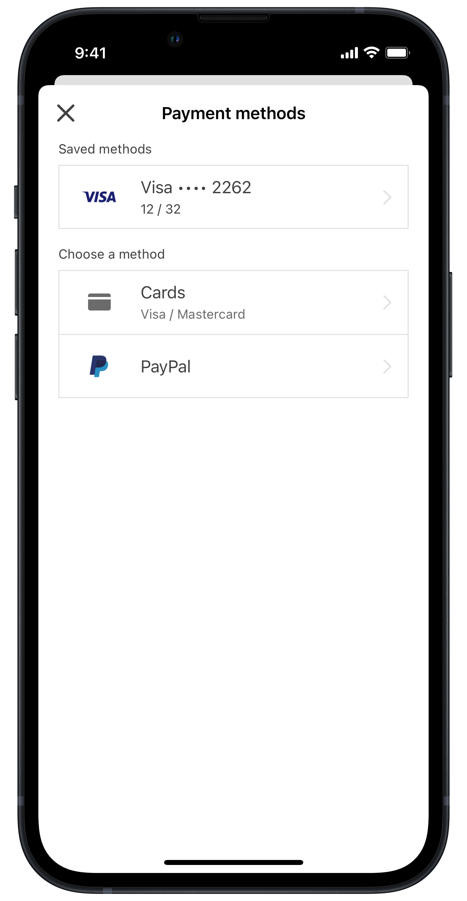

With Payoneer’s Checkout SDK for iOS you can accept payments in your app and provide a complete checkout experience. The SDK takes care of the entire payment flow and handles all communication with the Open Payment Gateway (OPG) with minimum effort from you and your team, and without requiring a high level of PCI-DSS compliance.

For information about integrating the Checkout SDK into your app, visit the [documentation portal](https://checkoutdocs.payoneer.com/docs/checkout-ios-sdk).

